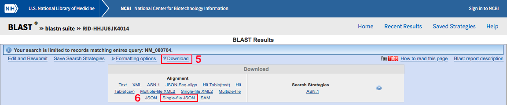

# Site-Directed Mutagenesis Verifier (SDMV)

SDMV quickly verifies the success of site-directed mutagenesis with two usage options: 

1. Upload an alignment file downloaded from BLASTN. 
2. Copy and paste query sequence and reference sequence accession number (easiest).

### To begin the program: 

Command line: `java alignmentparser.Main [mutation1] [mutation2]`

At least one mutation argument is required, and it must be formatted in amino acid mutation notation, e.g. L547M. 

### How to obtain a BLASTN alignment file:

Since option 1 consists of uploading an alignment file downloaded from BLASTN, you need to obtain the alignment file first. 

What you will need: 

- a web browser
- query sequence (your mutated sequence)
- reference sequence or its accession number

This example uses Safari, a query sequence copied from a .seq file, and a reference sequence accession number. The query sequence is a segment of the human TRPV1 protein that is supposed to have undergone site-directed mutagenesis with the mutation L547M. 

Instructions:

1. Open your browser and navigate to the [BLASTN page](https://blast.ncbi.nlm.nih.gov/Blast.cgi?PROGRAM=blastn&PAGE_TYPE=BlastSearch&LINK_LOC=blasthome).
2. Copy and paste the query sequence in the "Enter Query Sequence" section.
3. Check the "Align two or more sequences" box. 
4. Enter the accession number in the "Enter Subject Sequence" section.
5. Press "BLAST".

6. Open the "Download" drop-down menu. 
7. Download the alignment formatted as single-file JSON.
